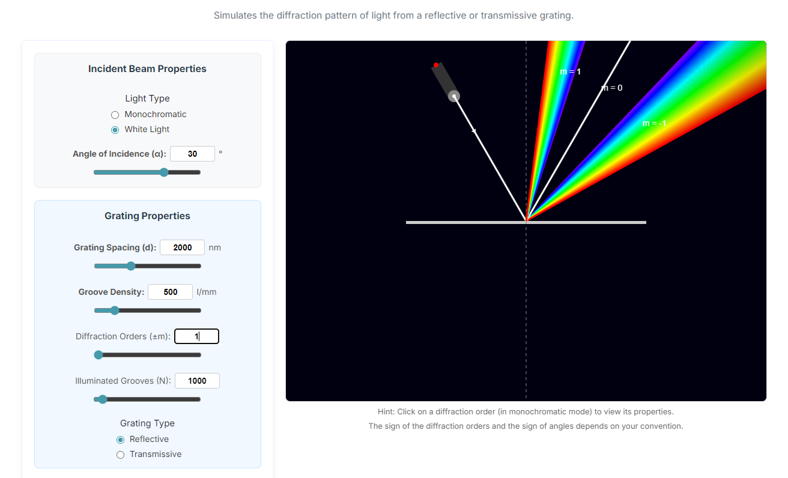

# Diffraction Grating Simulator

An interactive, web-based simulator that provides a real-time visualization of the diffraction pattern produced by a reflective or transmissive grating. This tool allows users to explore the principles of optical diffraction by adjusting a comprehensive set of parameters for both the incident light and the grating itself.

## Live Demo

Experience the simulator live at: **[visuphy.github.io/DiffractionGrating](https://visuphy.github.io/DiffractionGrating)**

## Screenshot

## Features

*   **Dual Light Modes:** Simulate diffraction for both **Monochromatic** and **White Light** sources.
*   **Comprehensive Beam Controls:**
    *   Adjust the **Wavelength (λ)** of monochromatic light with a dynamic range.
    *   Set the **Bandwidth (Δλ)** to observe the effect of spectral line width.
    *   Modify the **Angle of Incidence (α)** of the light source.
*   **Detailed Grating Properties:**
    *   Control **Grating Spacing (d)** or, alternatively, the **Groove Density** (lines/mm).
    *   Select the number of **Diffraction Orders (±m)** to display.
    *   Define the number of **Illuminated Grooves (N)** to see its effect on resolving power.
    *   Switch between **Reflective** and **Transmissive** grating types.
*   **Interactive Analysis:**
    *   In monochromatic mode, **click on any diffraction order** to view its key quantitative properties.
    *   Displayed data includes the precise diffraction angle, angular dispersion, temporal dispersion (GVD), and the system's resolving power.
*   **Littrow Condition Display:** The simulator calculates and displays the wavelength and angle required to satisfy the Littrow condition for m=1 based on the current setup.

## How to Use

1.  **Launch the Simulator:** Open the [live demo link](https://visuphy.github.io/DiffractionGrating) in your browser.
2.  **Select Light Properties:**
    *   Choose between `Monochromatic` or `White Light`.
    *   If monochromatic, use the sliders or input boxes to set the Wavelength and Bandwidth.
    *   Adjust the Angle of Incidence for the incoming beam.
3.  **Configure Grating Properties:**
    *   Use the sliders or input fields to set the Grating Spacing or Groove Density. Note that changing one will automatically update the other.
    *   Set the maximum number of diffraction orders and illuminated grooves.
    *   Select whether the grating is `Reflective` or `Transmissive`.
4.  **Analyze the Results:**
    *   Observe the diffraction pattern on the canvas.
    *   For detailed analysis, switch to `Monochromatic` mode and click on a specific diffracted ray (e.g., `m = 1`). The calculated physical properties for that order will appear in the top-left corner of the canvas.

## Technical Details

This simulator is built entirely with client-side web technologies:

*   **HTML5:** For the structure and layout of the user interface.
*   **CSS3:** For styling the controls and ensuring a responsive design.
*   **JavaScript:** For the core simulation logic, physics calculations, and rendering on the HTML5 Canvas.

No external libraries or frameworks are required, ensuring the simulator is lightweight and fast-loading.

## Contributing

Feedback and contributions are welcome! If you encounter any bugs, have suggestions for new features, or would like to improve the code, please feel free to:

*   **Report an issue:** Open an issue on the [GitHub Issues page](https://github.com/visuphy/DiffractionGrating/issues).
*   **Submit a pull request:** Fork the repository, make your changes, and submit a pull request for review.

## License

This project is licensed under the **MIT License**. See the `LICENSE` file for more details.

## Acknowledgments

*   **Original Author:** [Hussein-Tofaili](https://github.com/Hussein-Tofaili)
*   This project is maintained by [VisuPhy](https://github.com/visuphy).